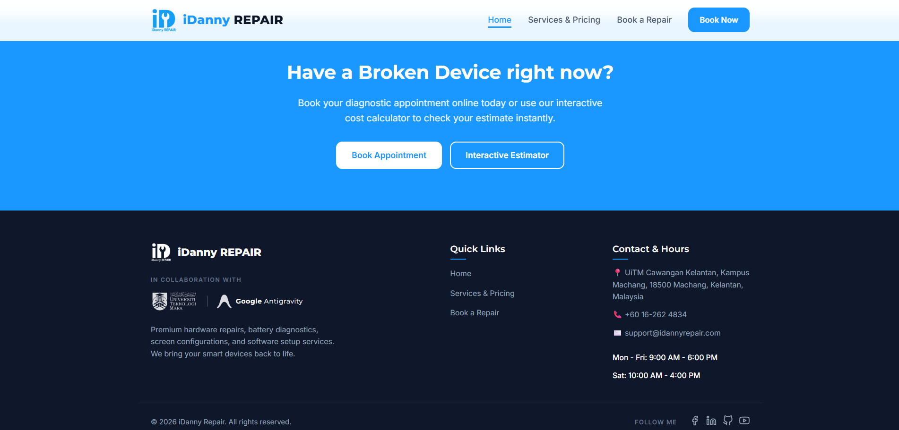

# 🔧 iDanny Repair - Interactive Small Business Website


An interactive, responsive, multi-page frontend website developed for **iDanny Repair**, a device repair shop specializing in hardware repairs for smartphones, laptops, tablets, and gaming consoles.


---

## 🤝 Academic & Corporate Partners




* **Academic Institution:** Universiti Teknologi MARA (UiTM) Cawangan Kelantan, Kampus Machang
* **Engineering Support:** Google Antigravity AI Coding Team

---


## 📁 Directory Structure

```text
smallbusiness/
├── index.html                  # Homepage (Hero, core value props, testimonial slider)
├── services.html               # Services page (Services list, dynamic cost estimator, FAQ accordion)
├── book.html                   # Booking page (Reservation scheduler form with validations)
├── README.md                   # Project documentation & Git instructions
├── css/
│   └── style.css               # Design tokens, grid variables, layout classes, responsive queries
├── js/
│   ├── main.js                 # Vanilla JS logic (cost pricing calculator, custom form validator)
│   └── jquery-features.js      # jQuery components (testimonial carousel, FAQ accordion, reveal animation)
└── images/
    ├── iDannyRepair_Logo.png   # Main blue-and-white theme logo
    ├── hero_tech_repair.jpg    # Generated modern hero illustration
    ├── antigravity.png         # Google Antigravity team icon
    └── LOGO_UiTM_OUTLINE_3(WHITE).png # UiTM academic institution outline logo
```

---

## 🎯 Rubric Fulfillment Map

Here is how the project maps directly to the 100-mark grading system:

| Marks | Section | Implementation Strategy |
| :--- | :--- | :--- |
| **20 Marks** | **HTML Structure & Semantics** | * Uses standard HTML5 tags (`<header>`, `<nav>`, `<main>`, `<section>`, `<article>`, `<footer>`) instead of general divs.<br>* Clean 3-page site navigation loops.<br>* Inputs are fully connected to labels (`for` / `id` properties). Supports diverse input types (`text`, `email`, `tel`, `date`, `select`, `radio`, `textarea`). |
| **25 Marks** | **CSS Styling & Responsiveness** | * Modern layout styled via CSS Grid (for services/features) and CSS Flexbox (for nav header and card items).<br>* Responsive design verified on Mobile, Tablet, and Desktop using media queries.<br>* Styled transitions and lifts for click targets and social media links. |
| **20 Marks** | **Vanilla JavaScript** | * Custom form validations checking string lengths, email patterns, phone patterns, and past dates without using basic popups.<br>* Live cost calculator executing custom numeric increments on checking repair issues. |
| **25 Marks** | **jQuery Integration** | * Testimonial carousel featuring auto-play intervals, manual arrows, and indicator dots.<br>* FAQ accordion handling toggled displays while collapsing inactive questions.<br>* Viewport reveals checking coordinates and adding classes dynamically on scroll. |
| **10 Marks** | **File Quality & UX** | * Clean directory layout structure.<br>* Documented, clean code comments.<br>* Fully free of console runtime errors. |

---

## 💻 Running the Code Locally

No installation or environment server setup is required. 
1. Clone this repository or download the folder.
2. Simply double-click [index.html](index.html) (or open it in Google Chrome, Microsoft Edge, or Safari) to start exploring the website interface!

---

## 🚀 Pushing to GitHub

To upload this project to your GitHub account:

1. Initialize Git in the local project directory:
   ```bash
   git init
   ```

2. Add all project files to staging:
   ```bash
   git add .
   ```

3. Commit the changes:
   ```bash
   git commit -m "Initial commit: iDanny Repair website for UiTM assignment"
   ```

4. Create your remote repository on [GitHub](https://github.com/), copy the repo URL, and link it:
   ```bash
   git branch -M main
   git remote add origin https://github.com/KuDanial/YOUR_REPO_NAME.git
   ```

5. Push the code:
   ```bash
   git push -u origin main
   ```

---


